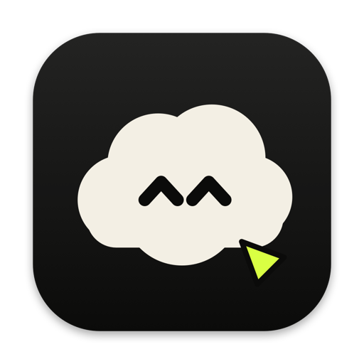
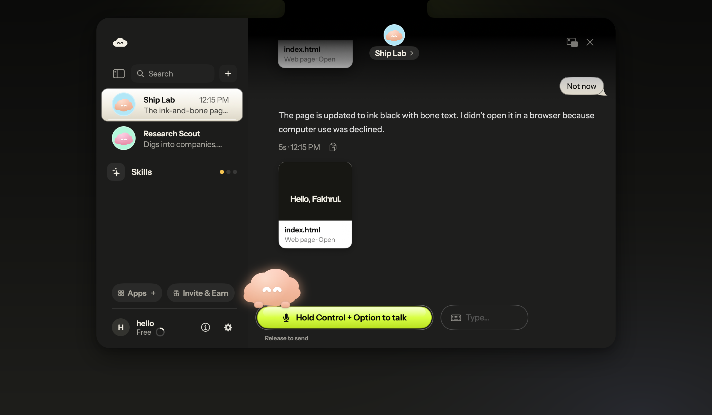
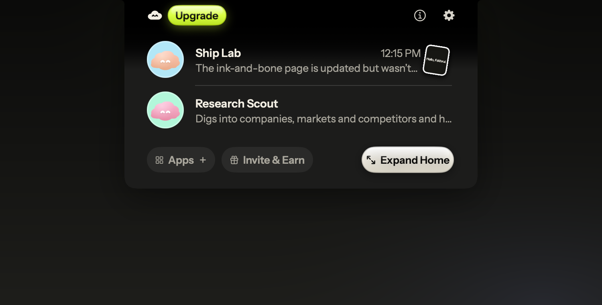
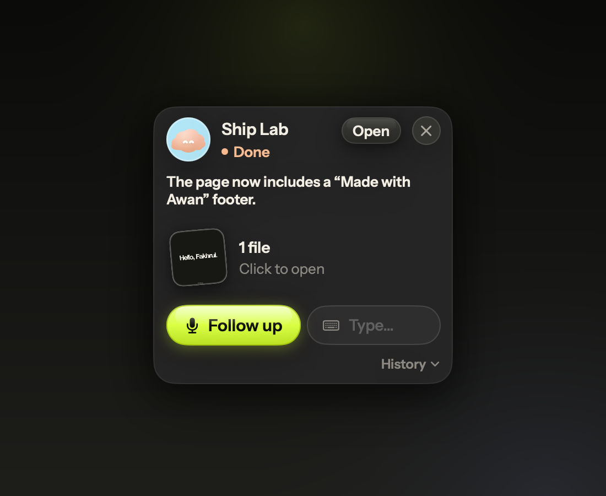
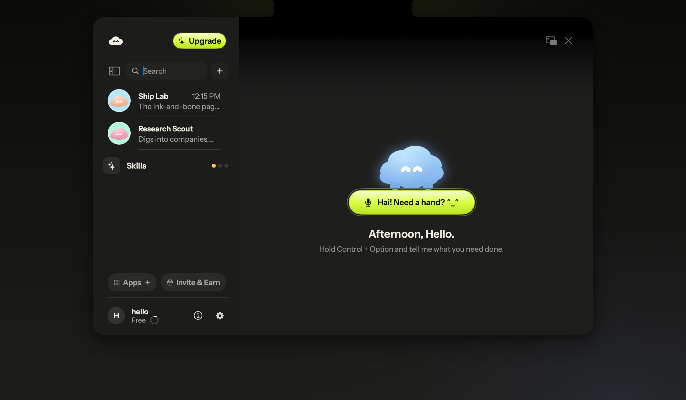
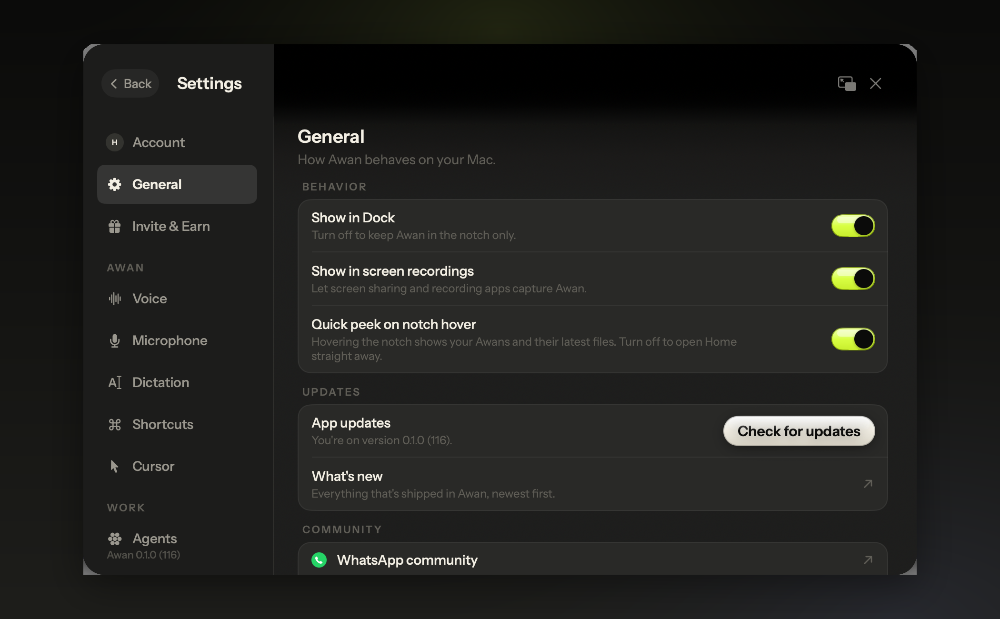
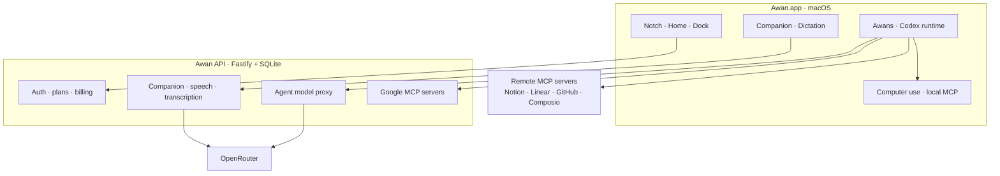

<div align="center">



# Hai Awan

**Awan is an AI buddy that lives in your Mac's notch.**<br/>
Hold two keys and talk. It sees your screen, points at things, types for you,<br/>
and sends a team of little Awans off to get real work done in the background.

[](#requirements)
[](app/Package.swift)
[](server/package.json)
[](server)
[](LICENSE)
[](https://awan.ffdev.studio)

<sub>Hai Awan is the product. Awan is the app. Fully open source, built by <a href="https://ffdev.studio">FF Dev Studio</a>.</sub><br/>
<sub><a href="https://awan.ffdev.studio"><b>awan.ffdev.studio</b></a></sub>

<br/>



</div>

---

## Contents

- [What Awan does](#what-awan-does)
- [A tour](#a-tour)
- [How it works](#how-it-works)
- [Repository layout](#repository-layout)
- [Getting started](#getting-started)
- [Configuration](#configuration)
- [Keyboard shortcuts](#keyboard-shortcuts)
- [Testing](#testing)
- [Releasing](#releasing)
- [Status](#status)
- [Privacy](#privacy)
- [Credits](#credits)
- [License](#license)

---

## What Awan does

Awan (Malay for *cloud*, and the shape of the little mascot) sits in the notch at the top of your screen. There's no
window to open and no app to switch to: you talk, it answers out loud, and it can act on what it sees.

### Talk to it
- **Push to talk.** Hold <kbd>⌃</kbd> <kbd>⌥</kbd>, say what you need, let go. Awan hears you, looks at your screen and
  answers in a natural voice. Ten voices, adjustable speed.
- **Always on.** Triple-tap <kbd>⌃</kbd> for a hands-free conversation; triple-tap again to stop.
- **Text mode.** Double-tap <kbd>⌃</kbd> and type instead. Replies stream into a card under the notch.

### It sees and points
- **Screen-aware answers** across every display. Ask *"what's wrong with this chart?"* and it answers about the chart.
- **A cursor buddy** that follows your pointer, then flies across the screen to point at the button, cell or word it's
  talking about, with a label that types itself out.
- **Draw to ask.** Circle or scribble on anything while you talk, and Awan answers about exactly that region.

### Dictation anywhere
- Hold <kbd>fn</kbd> <kbd>⌃</kbd> in any text field and speak. Awan transcribes, removes the *ums*, fixes punctuation
  and types it where your cursor is. Double-tap for hands-free dictation.
- Pick languages, auto-detect across them, and teach it your words with a personal dictionary.

### A team of Awans
- **Agents in the background.** Say *"hey Awan, research my competitors and save it as a PDF"* and an Awan spins up,
  works on its own, and taps you when it's done. Each Awan has a name, a role, a character and its own folder.
- **Real tools.** Awans read and write files, run code, browse, build web pages and documents, and hand back the
  artifacts they made, opened for you when the work is finished.
- **Computer use, with consent.** When a task needs your mouse and keyboard, the Awan asks first. Allow it once, or
  always, per Awan.
- **Routines.** *"Check the site still loads every morning"* becomes a schedule that runs on its own.
- **Suggestions.** Every day Awan proposes a few jobs worth doing, based on what you're working on. Say yes, adjust,
  or skip.
- **Skills.** A library of instruction packs (writing voice, research reports, spreadsheets, design critique…) you can
  switch on per Awan, or write your own.

### Home, in the notch
- **Quick peek.** Hover the notch to see every Awan, its latest message and newest file. Drag files straight out.
- **Home** grows out of the notch: a roster of your Awans, iMessage-style threads, an inspector with their routines
  and files, and Settings. Pop it out into its own window any time.
- **Dock.** Running or finished Awans gather at the top right; hover one for a card with its result, files and a
  follow-up box.

### Make it yours
- **Characters.** Pick from character packs or build your own (shape, colour, face, hair, outfit), with reactions.
- **Integrations.** Gmail, Calendar, Drive, Docs and Sheets are first-party (Awan hosts the MCP servers). Notion,
  Linear, GitHub, Figma, Stripe, Sentry and more connect as remote MCP servers, plus any custom connector you add.
- **Plans and referrals.** Free, Pro and Max plans with monthly or yearly billing, team seats, and a referral
  programme that pays a share of what friends spend.

---

## A tour

<table>
  <tr>
    <td width="50%"><br/><sub><b>Quick peek.</b> Hover the notch: every Awan, its latest note and newest file.</sub></td>
    <td width="50%"><br/><sub><b>Dock card.</b> A finished Awan's result, its file, and a follow-up box.</sub></td>
  </tr>
  <tr>
    <td width="50%"><br/><sub><b>Home.</b> Grows out of the notch. The mascot sits on the talk pill.</sub></td>
    <td width="50%"><br/><sub><b>Settings.</b> Account, voice, microphone, dictation, shortcuts, cursor, agents, integrations.</sub></td>
  </tr>
</table>

---

## How it works



- **One provider key.** The API holds a single OpenRouter key that powers the companion (vision + chat), speech,
  transcription, dictation clean-up and the agent model. Keys never ship in the app.
- **Agents** run on the vendored OpenAI Codex CLI (`app-server` mode) with its model provider pointed at the Awan API,
  so usage is metered per plan. Each Awan gets its own workspace folder, skills and MCP tools.
- **Computer use** is a local MCP server inside the app (accessibility tree + CGEvent input), reachable only from
  localhost and only after the user says yes.
- **The notch** is a fixed transparent panel with the shape animating inside it on springs, so the peek grows out of
  the handle and the Home grows out of the peek.
- **Tags in replies** (`[POINT:x,y:label]`, `[HIGHLIGHT]`, `[SHAPE]`, `[TYPE]`…) drive the cursor buddy; agent turns
  end with structured blocks (summary, next actions, artifacts, routines, computer-use requests).

---

## Repository layout

```
.
├── app/                     macOS app (SwiftPM, macOS 14+)
│   ├── Sources/Awan/
│   │   ├── App/             entry point, app state, launch self-tests
│   │   ├── Notch/           notch panel, quick peek, surfaces (text, dictation, cards)
│   │   ├── Home/            Home window, threads, inspector, Settings, paywall, editor
│   │   ├── Companion/       voice pipeline, hotkeys, screen capture, pointing tags
│   │   ├── Overlay/         cursor buddy, pointing flights, drawings, dock
│   │   ├── Agents/          Awans, Codex runtime bridge, routines, connectors, computer use
│   │   ├── Dictation/       dictate-anywhere, clean-up, dictionary
│   │   ├── Onboarding/      intro, permissions, tutorial, interview, plans
│   │   ├── Characters/      character packs, editor, reactions
│   │   ├── Skills/          skills library
│   │   ├── Design/          theme tokens, components
│   │   └── Debug/           headless snapshot harness + self-tests
│   ├── Resources/           fonts, synthesized UI sounds, skills, logos, pre-rendered speech
│   └── scripts/             build-app, fetch-codex, make-dmg, release, icon/sound generators
├── server/                  Awan API (Node 26, Fastify, node:sqlite)
│   ├── src/                 routes, LLM + speech, auth, plans, billing, teams, connectors, Composio
│   ├── migrations/          SQL migrations
│   └── test/                node:test suites
├── site/                    Hai Awan website (Vite, static)
├── docs/images/             README images
└── THIRD_PARTY_NOTICES.md
```

---

## Getting started

### Requirements

| | |
|---|---|
| macOS | 14 Sonoma or later (Apple silicon recommended) |
| Swift | 6.x toolchain (Xcode or the Command Line Tools) |
| Node | 26 or later (the API runs TypeScript natively, no build step) |
| Keys | An [OpenRouter](https://openrouter.ai) API key. Everything else is optional. |

### 1. Run the API

```bash
cd server
cp .env.example .env        # then set OPENROUTER_API_KEY
npm install
npm run migrate
npm run dev                 # http://127.0.0.1:8787
```

With no mail provider configured, the dev server logs sign-in links instead of emailing them, and billing runs on
local checkout pages that activate plans without charging.

### 2. Build the app

```bash
cd app
./scripts/fetch-codex.sh    # vendors the Codex CLI runtime into Vendor/codex
./scripts/build-app.sh      # assembles and signs build/Awan.app
open build/Awan.app
```

`build-app.sh` signs ad-hoc by default. Set `AWAN_SIGN_IDENTITY` to a stable identity so macOS keeps your privacy
permissions across rebuilds.

> **Launching for voice testing:** open `Awan.app` from Finder or the Dock. If you start the binary from a terminal,
> macOS attributes privacy checks to the terminal and stops the app when speech recognition starts.

### 3. Grant permissions

Onboarding walks you through **Microphone**, **Screen Recording** and **Accessibility** (drag the Awan icon into the
list). Awan only listens while you hold the talk keys, and only looks at your screen when you ask it something.

### 4. Run the site (optional)

```bash
cd site
npm install
npm run dev                 # http://127.0.0.1:5190
```

---

## Configuration

All server configuration lives in `server/.env` (see [`server/.env.example`](server/.env.example) for every option,
with comments).

| Variable | Needed for | Notes |
|---|---|---|
| `OPENROUTER_API_KEY` | **everything** | Chat, vision, speech, transcription, agents |
| `COMPANION_MODEL` · `FAST_MODEL` · `AGENT_MODEL` · `SPEECH_MODEL` · `TRANSCRIBE_MODEL` | model choice | Sensible defaults set |
| `PUBLIC_API_URL` · `PUBLIC_SITE_URL` | links, callbacks | Defaults to localhost |
| `RESEND_API_KEY` or `SMTP_*` | sign-in emails | Unset in dev: links are logged |
| `GOOGLE_CLIENT_ID` · `GOOGLE_CLIENT_SECRET` | Google sign-in, Gmail/Calendar/Drive/Docs/Sheets | Needs `CONNECTOR_KEY` in production |
| `STRIPE_SECRET_KEY` · `STRIPE_WEBHOOK_SECRET` | paid plans, team seats | Unset in dev: local checkout |
| `COMPOSIO_API_KEY` | one-click app catalogue | Optional |
| `OPENAI_API_KEY` | realtime voice | Optional; the default voice pipeline doesn't need it |

---

## Keyboard shortcuts

| Action | Default | |
|---|---|---|
| Talk | Hold <kbd>⌃</kbd> <kbd>⌥</kbd> | Release to send |
| Text mode | Double-tap <kbd>⌃</kbd> | |
| Dictate | Hold <kbd>fn</kbd> <kbd>⌃</kbd> | Types where your cursor is |
| Hands-free dictation | Double-tap <kbd>fn</kbd> <kbd>⌃</kbd> | Tap again to stop |
| Always-on voice | Triple-tap <kbd>⌃</kbd> | |
| Send a screen region | Hold <kbd>⌃</kbd> <kbd>⌥</kbd> <kbd>⇧</kbd> and drag | |
| Open Home | <kbd>⌃</kbd> <kbd>⌘</kbd> <kbd>A</kbd> | |

Every shortcut can be changed in **Settings → Shortcuts**.

---

## Testing

```bash
# API
cd server && npm test

# App: self-tests run inside the real binary (they work with the Command Line Tools, no Xcode needed)
cd app
swift build -c release
.build/release/Awan --selftest                    # UI + state checks
.build/release/Awan --onboarding-selftest
.build/release/Awan --companion-selftest          # live companion round-trip (needs the API)
.build/release/Awan --dictation-selftest file.wav # transcription + clean-up on a recording

# Headless snapshots of any surface, rendered to PNG
.build/release/Awan --snapshot notch-peek out.png
.build/release/Awan --snapshot homeui-thread out.png 907 627
.build/release/Awan --snapshot notch-selftest out.png
```

The snapshot harness renders every surface (notch, Home, Settings pages, onboarding steps, overlay states) without
touching the network or your files, so UI changes can be checked and measured in CI or on a locked screen.

---

## Releasing

```bash
cd app
./scripts/release-keys.sh   # once: creates the Ed25519 update key in ~/.awan-release (never commit it)
./scripts/release.sh 0.2.0  # builds, packages the DMG, signs it and writes site/public/appcast.xml
```

Updates ship through [Sparkle 2](https://sparkle-project.org): the app checks the appcast hourly and verifies every
download against the Ed25519 key baked into the app. `release.sh` never uploads anything. Deploying the site is a
separate step.

---

## Status

Hai Awan is early and fully open source. The app, API and site run end to end on a single OpenRouter key.

These pieces are built and tested against stand-ins, and switch on when their credentials are added:

- Email sign-in (Resend or SMTP) and **Continue with Google**
- First-party Google connectors (Gmail, Calendar, Drive, Docs, Sheets)
- Paid plans, team seats and the billing portal (Stripe)
- The one-click integration catalogue (Composio)
- Realtime speech-to-speech voice (OpenAI)

---

## Privacy

- **Local first.** Threads, Awans, files, skills and settings live on your Mac. Agent work happens in folders you can
  see and open.
- **Only when asked.** The microphone is on only while you hold the talk keys (or in always-on mode, which you turn on
  yourself). Screenshots are taken only when you ask something, and are never stored on the server.
- **Consent for control.** Computer use needs a yes from you, per Awan, and can be revoked in Settings.
- **Your keys stay on the server.** Provider keys never ship inside the app; third-party tokens are encrypted at rest
  (AES-256-GCM).

---

## Credits

Awan stands on some excellent open-source work. Full texts are in
[`THIRD_PARTY_NOTICES.md`](THIRD_PARTY_NOTICES.md).

- [OpenAI Codex CLI](https://github.com/openai/codex) (Apache-2.0): the agent runtime bundled in the app
- [Sparkle](https://github.com/sparkle-project/Sparkle) (MIT): software updates
- [farzaa/clicky](https://github.com/farzaa/clicky) (MIT): parts of the cursor buddy, capture and hotkey code are
  adapted from it (marked in the source)
- [trycua/cua](https://github.com/trycua/cua) (MIT): the computer-use design
- [openai/skills](https://github.com/openai/skills): the basis of several bundled skills, rewritten
- [Instrument Sans & Instrument Serif](https://github.com/Instrument) (SIL OFL 1.1): typography
- App logos in Settings → Integrations are trademarks of their owners, shown only to identify each service

---

## License

[MIT](LICENSE) © 2026 FF Dev Studio. Use it, fork it, ship it. Components listed in
[`THIRD_PARTY_NOTICES.md`](THIRD_PARTY_NOTICES.md) keep their own licences.

<div align="center">
<br/>
<picture>
  <source media="(prefers-color-scheme: dark)" srcset="site/public/img/ff-mark-cream.svg" />
  
</picture>
<br/>
<sub>Made in Malaysia by <a href="https://ffdev.studio">FF Dev Studio</a>.</sub>
</div>
